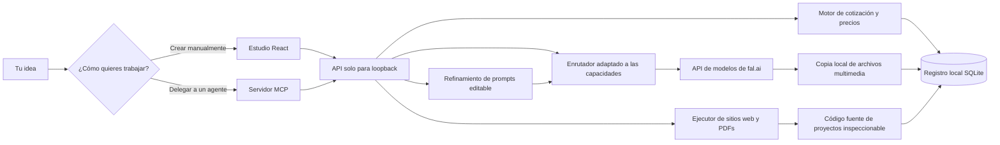
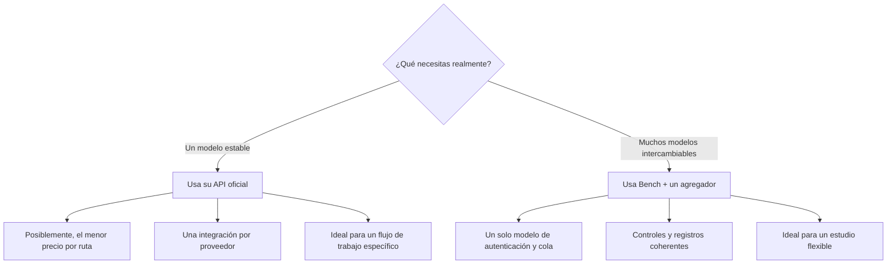
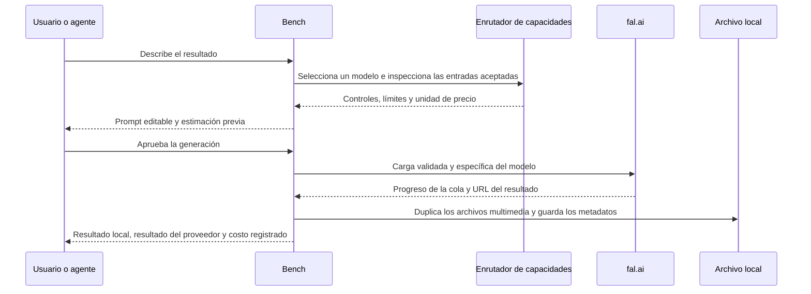
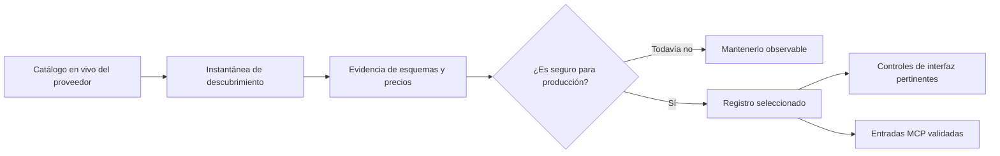
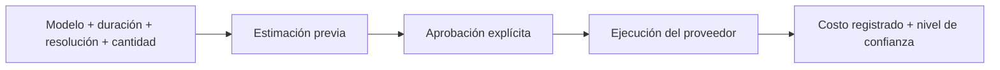
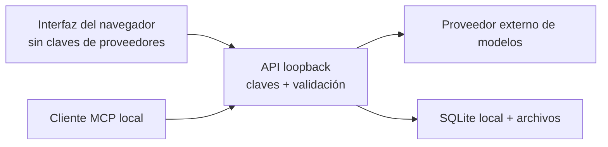

<div align="center">

# Bench Studio

**🇧🇷 [Português](README.md) · 🇺🇸 [English](README.en.md) · 🇪🇸 [Español](README.es.md)**

### Deja de alquilar la interfaz. Haz tuya la capa creativa.

Un estudio creativo local primero para imágenes, videos, sitios web, PDFs con diseño y flujos de trabajo con agentes de IA.

[](LICENSE)


**[Inicio rápido](#run-it-in-three-minutes)** · **[Cómo funciona](#the-system-in-30-seconds)** · **[Conectar un agente](#use-it-from-claude-codex-or-cursor)** · **[Seguridad](SECURITY.md)**

</div>

## 📖 Guía de uso

Guía completa (landing + paso a paso): **https://inematds.github.io/bench-studio-public/guia/es/**


Bench Studio reúne **37 rutas seleccionadas para imágenes y videos**, refinamiento de prompts,
controles adaptados a las capacidades, custodia local de archivos y un registro transparente de costos
en una sola interfaz. Claude, Codex, Cursor
y otros clientes compatibles también pueden acceder al mismo sistema a través de MCP.

Tus claves permanecen en el servidor de tu máquina. Puedes editar tus prompts antes de
gastar. Tus resultados se duplican localmente. Tus costos se registran en unidades reales
en lugar de desaparecer en créditos misteriosos.

> [!NOTE]
> Esta es la distribución pública depurada. No incluye historial de generación,
> cargas, base de datos privada, rutas personales, credenciales ni artefactos
> de compilación locales. Tu archivo comienza vacío.

## Por qué existe

La mayoría de los productos de IA creativa combinan cinco componentes útiles —acceso a modelos, mejora de prompts, enrutamiento, almacenamiento y facturación— y luego ocultan las conexiones detrás de un plan mensual.
Bench mantiene la comodidad y permite inspeccionar cada conexión.

| En lugar de… | Bench te ofrece… |
| --- | --- |
| La hoja de ruta de modelos de un proveedor | Un registro seleccionado que puedes ampliar o reemplazar |
| Una caja de carga genérica | Controles derivados de las entradas que acepta cada endpoint |
| Una reescritura invisible del prompt | Un borrador editable y específico para el modelo antes del envío |
| Créditos abstractos | Una estimación previa y metadatos del gasto registrado |
| Resultados atrapados en la galería de una cuenta | Archivos duplicados localmente y metadatos duraderos |
| Un flujo de trabajo limitado a la interfaz | Las mismas capacidades a través de la interfaz y MCP |
| Esperar la siguiente función | Código fuente que puedes inspeccionar, cambiar y ampliar |

Bench **no** es dueño de los modelos subyacentes. Te da el control de la capa portátil que conecta tus ideas, herramientas, proveedores, archivos y costos.

## Ejecútalo en tres minutos

### Lo que necesitas

- Node.js **22.5+**; se recomienda Node 24 porque Bench usa `node:sqlite`.
- npm.
- Una clave de API de [fal.ai](https://fal.ai/) para generar imágenes y videos.
- Google Chrome para imprimir PDFs y hacer una revisión visual previa.
- Opcional: una clave de API de Google para refinar prompts.
- Opcional: una instalación de Codex con sesión iniciada para crear sitios web y documentos.

### 1. Clona e instala

```bash
git clone https://github.com/promptadvisers/bench-studio-public.git
cd bench-studio-public
npm install
```

### 2. Añade credenciales del lado del servidor

Bench lee las credenciales desde `~/.env`. Nunca pongas claves de proveedores en variables de Vite ni las confirmes en el repositorio.

```dotenv
FAL_KEY=<your-fal-key>
GOOGLE_API_KEY=<your-optional-google-key>
```

`FAL_KEY` es obligatorio para generar contenido multimedia. Sin `GOOGLE_API_KEY`, Bench
sigue funcionando y envía tu prompt original sin refinarlo.

### 3. Inicia el estudio

```bash
npm run dev
```

Abre **[http://localhost:5200](http://localhost:5200)**.

| Servicio | Dirección |
| --- | --- |
| Studio | `http://localhost:5200` |
| API local | `http://localhost:8787` |
| Resumen de estado y capacidades | `http://localhost:8787/api/health` |

Si alguno de los puertos está ocupado:

```bash
PORT=8790 BENCH_API_PORT=8790 BENCH_WEB_PORT=5201 npm run dev
```

## Qué puedes crear

| Espacio de trabajo | Qué ofrece |
| --- | --- |
| **Create** | Imágenes y videos con referencias adaptadas al modelo, controles, borradores de prompts editables, cotizaciones, progreso y resultados integrados. |
| **Model catalog** | Rutas seleccionadas de texto a imagen, edición de imágenes, texto a video, imagen a video y video de referencia. |
| **Results** | Un archivo local con el prompt enviado, el modelo, la URL del proveedor, el archivo local y el costo registrado. |
| **Websites** | Sitios estáticos originales con código fuente editable, una vista previa local y un paquete descargable. |
| **Documents** | PDFs con diseño, basados en HTML editable, impresión con Chromium y revisión previa de desbordamiento. |
| **Connect** | Configuración de MCP adaptada a la máquina y una skill portátil para agentes compatibles. |


## El sistema en 30 segundos



El navegador nunca recibe secretos de proveedores. Se comunica con un servicio local que
valida las cargas específicas de cada modelo, administra las credenciales, transmite el progreso, duplica
los artefactos y registra metadatos duraderos.

## Elige la estrategia de conexión adecuada

Bench usa un agregador porque un único modelo de autenticación y cola es la forma
práctica de admitir un catálogo amplio e intercambiable. No es la
única arquitectura válida.



Un agregador no siempre es la opción más barata. Bench hace explícito ese costo de conveniencia en vez de llamarlo «recargo cero».

## Una solicitud, de la idea al comprobante



Bench registra lo que se envió. Nunca afirma que una referencia adjunta influyó en un resultado solo porque una API aceptó el campo; la fidelidad creativa aún requiere revisión humana.

## Inteligencia sobre los modelos, no un menú desplegable lleno de URLs

Cada endpoint tiene supuestos distintos. Algunos aceptan una imagen, otros aceptan
una lista, algunos requieren un fotograma inicial y otros no aceptan referencias. Bench mantiene el descubrimiento separado de la admisión para producción:



Esto evita que un modelo recién publicado, renombrado o con especificaciones incompletas interrumpa silenciosamente un flujo de trabajo de pago.

## El refinamiento de prompts permanece visible

1. Escribe una solicitud creativa normal.
2. Bench añade la estructura que probablemente entenderá el modelo seleccionado.
3. Revisa el prompt reescrito como borrador editable.
4. Cámbialo o recházalo antes de gastar nada.
5. Guarda el prompt final enviado junto con el resultado.

Si no hay una clave de Google configurada, el prompt original se envía sin cambios
y la interfaz informa que el refinamiento está desactivado.

## Transparencia de costos sin cálculos publicitarios

Antes del envío, Bench estima el costo a partir de la unidad de precio del modelo y los
parámetros solicitados. Al finalizar, registra el monto facturado cuando el proveedor expone suficientes datos del comprobante.



Los precios cambian. Las estimaciones no son garantías. Bench distingue entre valores estimados,
medidos y registrados, en vez de presentar los tres como si fueran el mismo dato.

## Los límites de tus datos locales

El repositorio comienza sin directorio `data/`. Bench lo crea en la primera ejecución:

```text
data/
├── bench.db              # generaciones, recursos, gastos y proyectos
├── inputs/               # cargas duplicadas localmente
├── outputs/              # generaciones duplicadas localmente
├── previews/             # carteles locales de video
└── projects/             # archivos fuente de sitios web y documentos
```

Git ignora todo el directorio. Al eliminar un resultado, se borran su registro en la base de datos local y sus archivos duplicados. Esto no significa que se eliminen las copias que conserve un proveedor externo de modelos.



## Úsalo desde Claude, Codex o Cursor

Inicia Bench, abre **Connect**, elige tu cliente y copia la configuración generada. Bench inserta la ruta absoluta correcta para la máquina actual;
el repositorio no incluye el directorio personal de ningún usuario.

El servidor MCP ofrece once herramientas específicas para:

- descubrir modelos e inspeccionar contratos de capacidades;
- cargar archivos multimedia locales de referencia;
- generar imágenes y videos;
- consultar resultados, vistas previas y gastos;
- crear y consultar proyectos de sitios web o documentos;
- recuperar artefactos de proyectos locales.

La skill incluida en `integrations/skills/bench-studio/` ofrece criterios y orientación para los flujos de trabajo. MCP proporciona la capa de ejecución en vivo.

## Mapa del proyecto

```text
bench-studio-public/
├── src/                     # Interfaz React
├── server/
│   ├── server.mjs           # API loopback y orquestación
│   ├── mcp.mjs              # Servidor MCP por stdio
│   ├── registry.json        # Lista de modelos seleccionados para producción
│   ├── capabilities.json    # Contratos de entradas aceptadas
│   ├── profiles/            # Inteligencia sobre prompts y precios
│   └── mcp-app/             # Interfaz MCP integrada
├── integrations/
│   ├── skills/bench-studio/ # Skill portátil de flujo de trabajo para agentes
│   └── macos/               # Plantillas opcionales de launch-agent
├── tests/                   # Contratos, persistencia, API, accesibilidad y E2E
├── docs/                    # Recursos multimedia del README público
├── .env.example             # Solo valores de marcador
└── package.json
```

## Comandos útiles

| Comando | Propósito |
| --- | --- |
| `npm run dev` | Iniciar la API local y la interfaz web. |
| `npm run build` | Compilar la aplicación web para producción. |
| `npm run registry` | Reconstruir el registro seleccionado de modelos. |
| `npm run capabilities` | Reconstruir el manifiesto de capacidades. |
| `npm run catalog:sync` | Actualizar la información del catálogo del proveedor y la evidencia de precios. |
| `npm run mcp` | Iniciar el servidor MCP por stdio. |
| `npm run test:contracts` | Ejecutar pruebas de API, persistencia y contratos de modelos. |
| `npm run test:mcp` | Probar el descubrimiento de MCP y el comportamiento multimedia. |
| `npm run test:e2e` | Ejecutar recorridos del navegador y verificaciones de accesibilidad. |
| `npm run test:release` | Ejecutar toda la validación de la versión. |

## Seguridad y privacidad

- La API se enlaza a loopback de forma predeterminada. No la expongas públicamente sin autenticación y un modelo de amenazas deliberado.
- Las claves se leen del lado del servidor desde `~/.env` y nunca se devuelven a la interfaz.
- `.env*` está ignorado, excepto `.env.example`, que solo contiene valores de marcador.
- Se ignoran los datos locales, informes, compilaciones generadas, resultados de pruebas y traspasos.
- Un proveedor externo puede conservar los archivos multimedia generados según sus términos.
- La creación de sitios web y documentos puede invocar un agente de programación autenticado localmente. Revisa el código fuente generado antes de publicarlo.

Lee [SECURITY.md](SECURITY.md) antes de exponer, modificar o redistribuir el servicio.

## Límites claros

- Bench es una herramienta local para un solo usuario, no un producto SaaS alojado para varios clientes.
- El registro se selecciona intencionalmente; que un modelo aparezca en el catálogo no garantiza su admisión en producción.
- Las entradas aceptadas no garantizan fidelidad creativa.
- Los sitios web se generan como contenido estático por diseño.
- La creación de PDFs depende de una instalación local de Chrome.
- La disponibilidad y los precios de los modelos pueden cambiar después de sincronizar el catálogo.
- Ser dueño de la capa implica mantener una pequeña pieza de software.

## Confianza en la versión

La validación de la versión cubre compilaciones de producción, contratos de API y base de datos, descubrimiento de MCP, recorridos del navegador, accesibilidad, adaptación a distintos tamaños de pantalla, estados de error, transiciones entre modelos e instantáneas visuales.

```bash
npm run test:release
```

## Licencia

Bench Studio Public está disponible bajo la [Licencia MIT](LICENSE).

---

<div align="center">

**Los modelos hacen el trabajo pesado. Bench hace visible la capa que los rodea y la pone en tus manos.**

</div>
